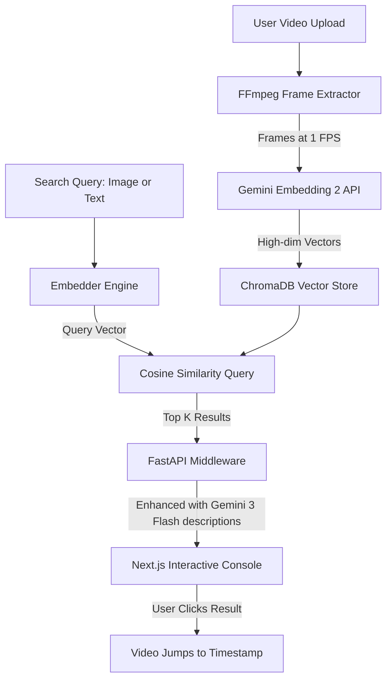

# 🎬 Multimodal Video Moment Finder

> **Winner-caliber Hackathon Entry** | Pure native cross-modal visual search powered by Gemini Embedding 2.

[](https://fastapi.tiangolo.com)
[](https://nextjs.org)
[](https://aistudio.google.com/)
[](https://www.trychroma.com/)

---

## ⚖️ Hackathon Evaluation & Judging Portal

Welcome, Judges! This section outlines how to evaluate the **Multimodal Video Moment Finder (Project Sentinel)**.

### 🏆 Criteria Alignment Matrix

| Hackathon Criterion | How We Hit It | Technical Details |
| :--- | :--- | :--- |
| **Technical Complexity** | Multi-threaded frame ingest, vector DB integration, multi-model Gemini utilization. | FastAPI + `ffmpeg` frame extraction at 1 FPS, batch embedding (6 frames/request API limit), and vector persistence in ChromaDB using Cosine similarity. |
| **Innovation & Creativity** | True cross-modal search using unified vectors. | We do not translate images to text. We represent visual features and text semantics as vectors in the *same* space. A user can search for a scene by pasting a picture of it. |
| **UI/UX Design & Polish** | The **Project Sentinel Forensic Console**. | A dark-themed security dashboard featuring live terminal-style logging, drag-and-drop target uploads, instant video seek to matching frames, and real-time feed filtering. |
| **Real-World Utility** | CCTV forensics, media catalog searching, and drone analysis. | Security officers or video editors can search thousands of hours of video in seconds to find specific visual events (e.g., "red car passing", or matching a suspect's photo). |

---

### 🕹️ Live Demo Walkthrough (Start Here)

Ensure both servers are running before following these steps (see [Setup & Installation](#-setup--installation) below).

#### Step 1: Open the Forensic Console
Navigate to [http://localhost:3000](http://localhost:3000) in your web browser to load the dark-themed **PROJECT SENTINEL v3.4 FORENSIC CONSOLE**.

#### Step 2: Select a Pre-Loaded Forensic Feed
Two sample videos have been pre-processed and indexed for you:
1. **CCTV Feed** (`WhatsApp Video 2026-06-07 at 18.57.38.mp4`): Footage representing standard street surveillance.
2. **Drone/Nature Feed** (`14671265_3840_2160_24fps.mp4`): High-definition aerial drone footage of nature, highways, and forest trails.

*Click on either of the feed cards at the bottom of the left panel to load the video and active metadata.*

---

### 🧪 Test Cases & Search Queries

Try these pre-verified queries to see the cross-modal search in action:

#### Test Case A: CCTV Forensic Search (Text Query)
1. Select the **CCTV Feed** or keep "**All Feeds**" active.
2. Switch the search panel to **TACTICAL TEXT DESCR**.
3. Type: `a person walking on the sidewalk next to a road` and click **SEARCH**.
4. **Result**: The top visual matches appear. Click any match to automatically jump the video player to that exact moment.
5. Notice that `gemini-3-flash-preview` has automatically generated a one-sentence visual description explaining *why* the frame matched!

#### Test Case B: Drone & Highway Search (Text Query)
1. Select the **Drone/Nature Feed**.
2. Search text: `aerial shot of a winding road in the forest` or `cars driving on the highway`.
3. **Result**: The engine will successfully locate the exact segments where roads appear amidst the trees or highway traffic is visible.

#### Test Case C: Drag-and-Drop Image Target Lookup (Visual Query)
We have extracted two screenshots from the feeds and saved them in the root [demo_targets/](file:///Users/tharunt/multimodal_video_moment_finder/demo_targets/) directory:
- [sample_cctv_target.jpg](file:///Users/tharunt/multimodal_video_moment_finder/demo_targets/sample_cctv_target.jpg)
- [sample_nature_target.jpg](file:///Users/tharunt/multimodal_video_moment_finder/demo_targets/sample_nature_target.jpg)

1. Switch the search panel to **IMAGE TARGET MATCH**.
2. Open the [demo_targets/](file:///Users/tharunt/multimodal_video_moment_finder/demo_targets/) folder on your computer.
3. Drag and drop [sample_nature_target.jpg](file:///Users/tharunt/multimodal_video_moment_finder/demo_targets/sample_nature_target.jpg) directly into the dashed box.
4. **Result**: The engine calculates the cosine distance of the image embedding against all video frames and ranks them. The correct moments will appear at the top, scoring close to `1.0`. Click the match to jump to the frame!

---

## 💡 The Value Proposition & Problem Statement

### The Problem
Traditional video search relies on metadata tags, manual timestamps, expensive speech-to-text transcriptions, or OCR. If a moment is purely visual (e.g., a specific scene, an actor's gesture, an unvoiced transition, or a visual object), it remains completely invisible to search engines unless manually captioned.

### The Solution
**Multimodal Video Moment Finder** changes the game. It enables users to upload any video and find specific visual moments using either **natural language queries** or **visual inputs** (dropping a screenshot of a scene). 

By leveraging native cross-modal embeddings, the system maps both images and text queries to the same unified vector space. **Zero transcription. Zero OCR. Zero pre-generated captions.** Just pure visual intelligence.

---

## 🏗️ Architecture & Data Flow



### Key Technical Insight
Unlike traditional workflows that require captioning models to create text descriptions of frames before embedding them, this engine utilizes Gemini's native multi-modal embedding capability. Both the video frame pixels and the search query are ingested directly by the model, preserving spatial-semantic context that is usually lost in text transcription.

---

## 🧠 Deep Tech Under the Hood

### 1. Vector Space Unification
The core of our technology is Google's `gemini-embedding-2-preview` model. 
```
  [Text Query]   ──> (Gemini Embed 2) ──> [768-dim Vector] ──┐
                                                             ├─> (ChromaDB Cosine Space)
  [Image Target] ──> (Gemini Embed 2) ──> [768-dim Vector] ──┘
```
Because both modalities output to the same semantic space, we can run a single query mathematical function regardless of the query type.

### 2. Live Description Engine
When a match is returned, we send the top-scoring frame to `gemini-3-flash-preview` with the prompt:
> *Describe what's happening in this video frame in one sentence.*

This provides the user with visual context and validation of the search results in real time.

---

## 🛠️ Tech Stack

- **Frontend**: Next.js (TailwindCSS/Vanilla CSS hybrid responsive layout, dark theme, interactive video controller).
- **Backend**: FastAPI (Python 3.10+), asynchronous processing.
- **Vector Database**: ChromaDB (configured with Cosine similarity space).
- **AI Models**:
  - `gemini-embedding-2-preview` (Native multi-modal embeddings)
  - `gemini-3-flash-preview` (On-demand frame descriptions)
- **Processing Engine**: `ffmpeg` (Frame extraction & validation).

---

## 📂 Project Structure

```
multimodal_video_moment_finder/
├── backend/
│   ├── server.py           # FastAPI application & REST endpoints
│   ├── video_store.py      # Core AI pipeline: extraction, embedding, vector store
│   └── requirements.txt    # Python environments and packages
├── demo_targets/           # Sample visual target files for judge testing
│   ├── sample_cctv_target.jpg
│   └── sample_nature_target.jpg
├── frontend/
│   ├── app/
│   │   ├── page.tsx        # Next.js Forensic Dashboard UI
│   │   ├── layout.tsx      # Application layout and wrapper
│   │   └── globals.css     # Dark-theme global CSS systems
│   ├── package.json        # Node dependency manifest
│   ├── next.config.ts      # Next.js framework configuration
│   └── tsconfig.json       # TypeScript compiler settings
└── README.md               # Hackathon Documentation
```

---

## 🚀 Setup & Installation

### Prerequisites
- **Node.js** v18+
- **Python** v3.10+
- **ffmpeg** installed (e.g. `brew install ffmpeg` or `apt-get install ffmpeg`)
- **Google Gemini API Key** (Get one at [Google AI Studio](https://aistudio.google.com/apikey))

---

### Step 1: Configure Backend Environment

1. Navigate to the backend folder:
   ```bash
   cd backend
   ```
2. Create and activate a virtual environment:
   ```bash
   python -m venv venv
   source venv/bin/activate
   ```
3. Install dependencies:
   ```bash
   pip install -r requirements.txt
   ```
4. Create a `.env` file in the `backend/` directory:
   ```env
   GOOGLE_API_KEY="your_actual_gemini_api_key"
   PORT=8890
   ```
5. Run the server:
   ```bash
   python server.py
   ```
   The API will start running at `http://localhost:8890`.

---

### Step 2: Configure Frontend Environment

1. Open a new terminal window and navigate to the frontend folder:
   ```bash
   cd frontend
   ```
2. Install dependencies:
   ```bash
   npm install
   ```
3. Create a `.env.local` file in the `frontend/` directory:
   ```env
   NEXT_PUBLIC_API_URL=http://localhost:8890
   ```
4. Launch the local developer server:
   ```bash
   npm run dev
   ```
   Open your browser to [http://localhost:3000](http://localhost:3000) to access the dashboard.

---

## 🔍 API Endpoint Specifications

| Method | Endpoint | Payload | Description |
| :--- | :--- | :--- | :--- |
| **POST** | `/upload-video` | `file` (Multipart), `fps` (Form Float) | Ingests a new video file, extracts frames, embeds them, and saves the vectors to ChromaDB. |
| **POST** | `/find-moment` | `image` (Multipart), `video_id` (Form String) | Matches an uploaded screenshot against indexed frames. |
| **POST** | `/find-moment-text` | `query` (JSON String), `video_id` (JSON String) | Matches a descriptive text query against indexed frames. |
| **GET** | `/videos` | *None* | Retrieves all ingested video records with stats (durations, frame count, source url). |
| **DELETE** | `/videos/{id}` | *Path Parameter* | Removes the video file and purges associated vectors from ChromaDB. |
| **GET** | `/health` | *None* | System status checklist and statistics. |

---

## 🔮 Future Vision & Roadmap

- [ ] **Real-time Camera Stream Sync**: Live search on running feeds.
- [ ] **Scene Transition Grouping**: Temporal clustering of frames into scenes to provide visual segments instead of single frames.
- [ ] **Hybrid Hybrid Search**: Combining native visual similarity with speech-to-text transcriptions for double-agent search.
- [ ] **Edge Deployment**: Using specialized mobile embedding pipelines for offline search on user-device video libraries.
